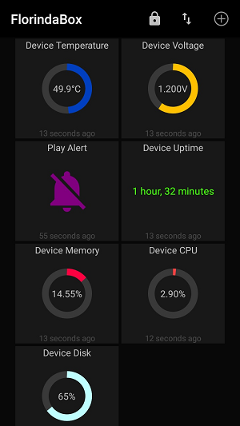

# FalseAlarm
IOT speaker - Alarm your friend at work!\
It has lovingly been called as **FlorindaBox**

## Purpose
Would you like to make funny moment even better?\
Play a sound via FalseAlarm using mosquitto (MQTT protocol)

## Setup
- Raspberry Pi3 B+
- TP Link router (TPWR702N)
- JBL Clip 2
- Hub USB
- Breadboard (200 point solderless)
- Temperature & Humidity sensor (DHT11)
- USB webcam
- Acrylic box

## Screenshots
