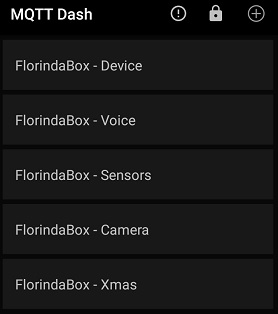
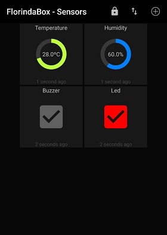

# FalseAlarm
IOT speaker - Alarm your friend at work!\
It has lovingly been called as **FlorindaBox**

More than a simple box, it become important device at home since we are not at office anymore.\
Check other functions:
- [Motion](motion/motion.sh)
- [PiHole](pihole/docker_run.sh)
- [Boinc](boinc/boinc.sh)
- [Tor](tor/tor.sh)

## Purpose
Would you like to make funny moment even better?\
Play a sound via FalseAlarm using mosquitto (MQTT protocol)

## Setup
- Raspberry Pi3 B+
- TP Link router (TPWR702N)
- JBL Clip 2
- Hub USB
- Breadboard (200 point solderless)
- Temperature & Humidity sensor (DHT11)
- USB webcam (Microdia Sonix USB 2.0 Camera)
- Acrylic box

## Remote

\
\

